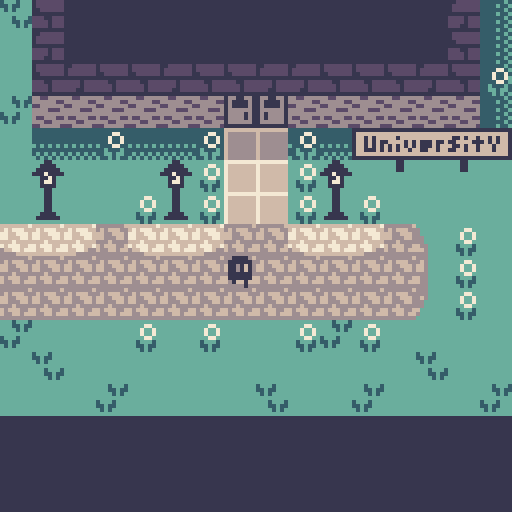

# Translocator Alpha

A tiny game by [BlipJoy](https://blipojoy.com/).

Made over a weekend for [inkjam-2023](https://itch.io/jam/inkjam-2023).

## About the game

In the early 19th century, a group of engineers at a prestigious university conduct an experiment with a machine called the translocator.

# Credits

Programming, writing, art, and music by Jay Oster with some suggestions from ChatGPT 3.5.

Uses a sample from [Pack: Double-Bass single notes by MTG](https://freesound.org/people/MTG/packs/20207/) Licensed under [`CC-BY`](https://creativecommons.org/licenses/by/3.0/). With some additional processing.
